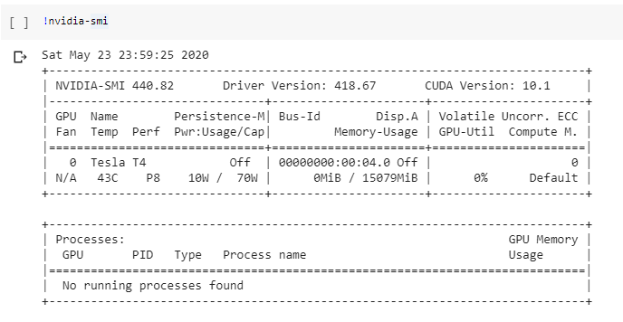
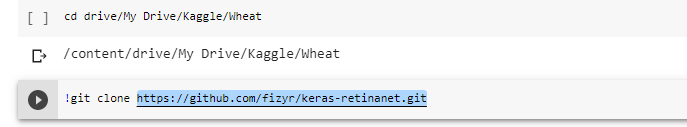

## kaggle-Wheat_head
Creation of a set of object detection models that are able to count wheat head in a image.


## Problem
Counting Detected wheat head in an image, using object recognition.

## Proposed Solution
This project was created to count the number of wheat heads detected in an image, it also has the possibility of generating a list of files that tell you exactly where the object identified are located in the image.

In this projecti will be leveraging both resnet a pretrained model, ResNet50 trained on coco dataset and keras-retinanet from this repository https://github.com/fizyr/keras-retinanet.git, the script for creating the models contained in this repository is Wheathead.ipynb, all the training process was carried out google collab. 

The neural network was trained using 3422 wheathead images, the test dataset contains 10 images. I will do my best to show you the implementation process but i would really just advice that you run the script *Wheathead.ipynb* this project project was inspired by the kaggle wheathead competition and the dataset used is just a part of the dataset available in the competition  


## Used Stack

- Python


## Benefits

- Provision of an software to help agriculturist and farmers estimate their wheat head yields.
- Creation of an agriculturally inclined A.I system.


##   Proposed directory layout

    .
    ├── Keras-retinanet         # Contains the keras retinanet files as well as the created models
    ├── train                   # Training images
    ├── test                    # Test Images
    ├── Wheathead.ipynb         # Training and Inference file
    └── README.md               # information and Instructions of Use


# How to setup project and run locally
You need to be running python 3 you will need also the following to run the neural net script for infrence
- Keras-retinanet
- Tensorflow
- matplotlib
- sklearn
- Open CV
- seaborn
- pandas
- numpy

## Clone this repository 
```
https://github.com/mrnninster/kaggle-Wheat_head.git
```

## Creating your model using google collab

<h3>
	Ensuring we are running gpu
</h3>

<p>
	So the first thing to do is make sure you are running a gpu instance. Even with a gpu, training can take more hours that you would like to know.
	Here i am just checking the kind of instance i ama running. Here i am running the Tesla T4 instance. After doing this you can mount your drive and
	navigate to your working directory.
</p>





<h3>
	Clonning Git Repo
</h3>

<p>
	You will need to clone this github repo with keras-retinanet as shown in the image below. Here is the link to the github repo 
	*!git clone https://github.com/fizyr/keras-retinanet.git*
</p>





<p>
	Ensure that you version of keras is up to date by running 
	*pip install --upgrade keras*
</p>


<p>
	Navigate into the keras-retinanet folder and pip install all, then run setup.py using python3 to build.
</p>


<p>
	You will need to import all the dependencies as shown in the image below. Please make sure you have all the requirements listed above if you want to run this locally on your computer/Laptop.
</p>


<p>
	Here you will be reading in the file that contains the annotation of the images. It is usually typically a csv file or an excel file.
</p>


<p>
	Here is the boundary box function created to test the dataset. Modify to fit your use.
</p>


<p>
	Here i am simply generatin the test and train dataset. After this i generated the annotations file and the classes file which will b used for training the neural network.
</p>


<h3>
	Training
</h3>

<p>
	I used a pretrained model, which is resnet50 trained on the coco dataset, it was downloaded to a predefined storage location, and i began training. 
</p>


<h2>
	Testing Trained models
</h2>

<p>
	The next series of images show the process of me testing the network and the result i obtained. like i said earlier, the results can be written to
	a csv/txt file.
</p>


